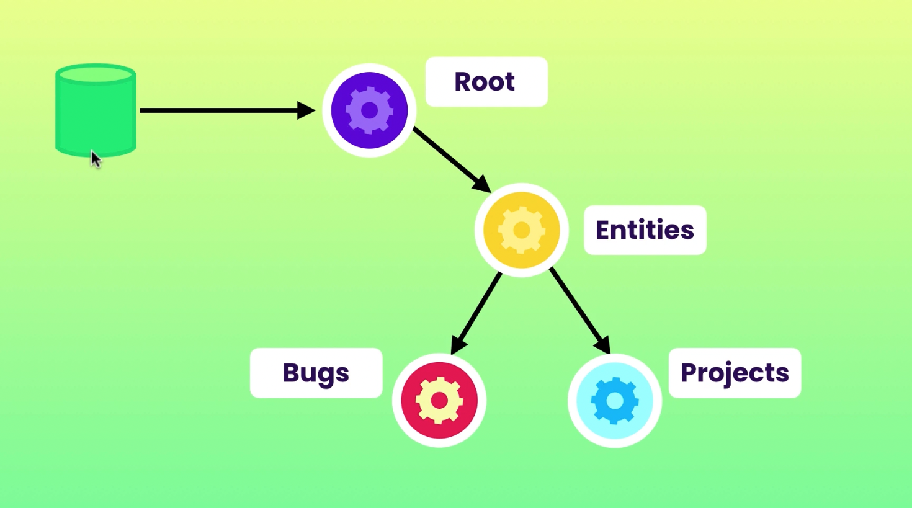

# Redux small App

<h1 align="center">Welcome to Osku Small Redux App 👋</h1>

<p>
  
  <a href="https://github.com/reduxjs" target="_blank">
    
  </a>
  <a href="#" target="_blank">
    
  </a>
</p>

> New Small App showing how Redux work

### 🏠 [Homepage](https://github.com/Osamah-learn/ReduxApp)

## Install

```sh
npm install
```

## Usage

```sh
npm start
```

## Author

👤 **Osamah Amer**

* Website: https://osamah-dev.tech/
* Github: [@Osamah-learn](https://github.com/Osamah-learn)
* LinkedIn: [@https:\/\/www.linkedin.com\/in\/osamah-amer-395a371b1\/details\/skills\/](https://linkedin.com/in/https:\/\/www.linkedin.com\/in\/osamah-amer-395a371b1\/details\/skills\/)

